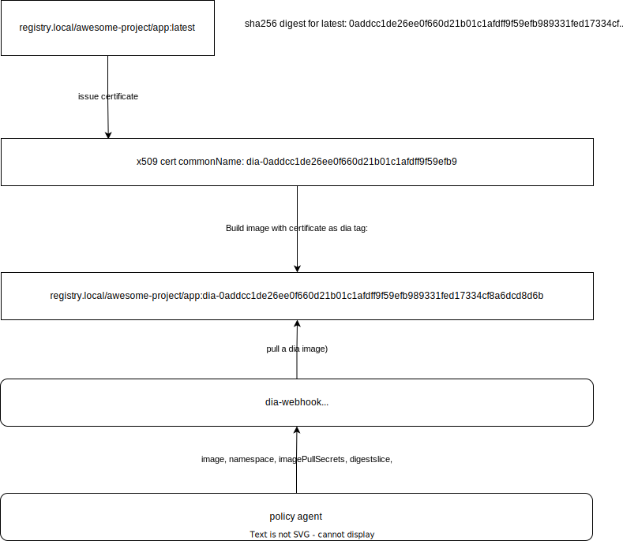

# DIA
## Docker image attestor

Just sign and verify your docker images with x509 certificates, keyless, really...
1. Build and push your image
2. Issue an x509 certificate: part of commonName must contain image digest(so-called digestslice)
3. Sign(push certificate) with dia-sign.sh or with your CI manually
4. Validate digestslice with kubernetes validation webhook

## Digestslice
Digestslice - a part of digest sha256. Digestslice used due to x509 commonName length limitation(64 characters).
By default digestslice = 0-45.

Example:

Full digest: 0addcc1de26ee0f660d21b01c1afdff9f59efb989331fed17334cf8a6dcd8d6b

commonName certificate must contain from 0 to 45 character: 0addcc1de26ee0f660d21b01c1afdff9f59efb98933

## Manual signing:

```
dia-sign.sh [ARGS] [IMAGE]
  -h, --help      print this help message
  -c, --cert      path to x509 certificate file (base64 encoded)
  -d, --digest    sha256 digest of image, will used instead [IMAGE]
EXAMPLE: dia-sign.sh -c /tmp/image.crt registry.local/test-app:v1
```

## Sign with gitlab and hashicorp vault(pki) and consul-template:
### Prerequsites
1. Vault integrated with gitlab via jwt auth method
2. PKI engine is up on vault

Example dynamic pki role for gitlab applications signer:
```json
{
  "allow_any_name": false,
  "allow_bare_domains": true,
  "allow_glob_domains": true,
  "allowed_domains": [
    "dia-{{identity.entity.aliases.auth_jwt_547d5757.metadata.gitlab_project_id}}-*",
    "{{identity.entity.aliases.auth_jwt_547d5757.metadata.gitlab_project_id}}-*"
  ],
  "allowed_domains_template": true
}
```

.gitlab-ci.yml example:
```yaml
make-test-image:
  image:
    name: ghcr.io/spanarek/dia/dia-dind:hashicorp0.1.0
  stage: build
  variables:
    VAULT_AUTH_ROLE: any
    VAULT_AUTH_PATH: auth/jwt/gitlab
    VAULT_ADDR: https://vault.local:8200
    VAULT_CAPATH: vault.pem
    VAULT_PKI_PATH: pki/issue/by-gitlab-id
    DOCKER_REG_IMAGE: registry.local/test-app
  script:
    - docker login -u "${REGISTRY_USER}" -p "${REGISTRY_PASSWORD}" "${REGISTRY_URL}"
    - docker build -t ${DOCKER_REG_IMAGE}:latest .
    - docker push ${DOCKER_REG_IMAGE}:latest
    - dia-sign.sh ${DOCKER_REG_IMAGE}
```

# Webhook
A webhook recieve your deployments and another yaml, and check digest and certificate issuer for image.
We don't check expiration dates, it's not really for images and some artifacts...

Responses:

image not signed:
```json
{"GET https://registry.local/test-app/manifests/dia-0addcc1de26ee0f660d21b01c1afdff9f59efb989331fed17334cf8a6dcd8d6b: NOT_FOUND: artifact test-app:dia-0addcc1de26ee0f660d21b01c1afdff9f59efb989331fed17334cf8a6dcd8d6b not found"}
```
certificate CN invalid
```json
{"Invalid certificate"}
```
certificate issued by unknown authority
```json
{"Certificate signed by unknown authority, crypto/rsa: verification error"}
```
dia image file does not contain x509 certificate on pem format
```json
{"failed to parse certificate"}
```

# Webhook install, helm chart:
Build an webhook image manually when needed
```
docker build -t your-registry.local/diawh -f webhook.Dockerfile .
```

## Chart
Webhook chart parameters: see chart/values.yaml
By default validating webhook enabled for namespaces with label: diawh=enabled

```bash
helm upgrade --install -n dia diawh chart/
kubectl label namespace sandbox diawh=enabled
```

# Arihitecture
 

# TODO
Sign with JWT tokens

# For developers

Local run and verify request example:

```bash
# Place your tls cert and key, attestor ca and go run
DIAWH_TLS_CERT=.local/diawh.crt DIAWH_TLS_KEY=.local/diawh.key DIAWH_ATTESTOR_CA_CERT=.local/ca.pem go run ./cmd/dia-webhook/
# Check request
curl --data '{"Request": {"UID":"dummy-uid"}}' -k https://localhost:8080/verify
```
